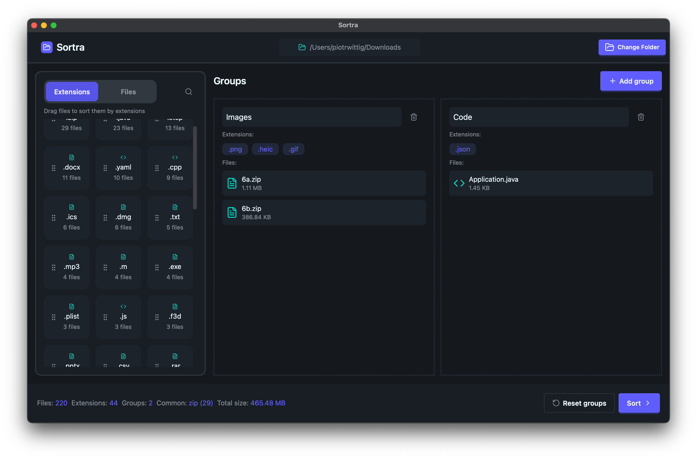
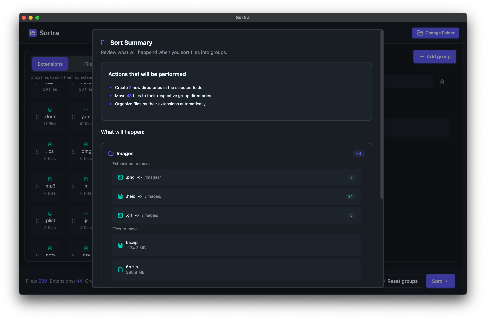
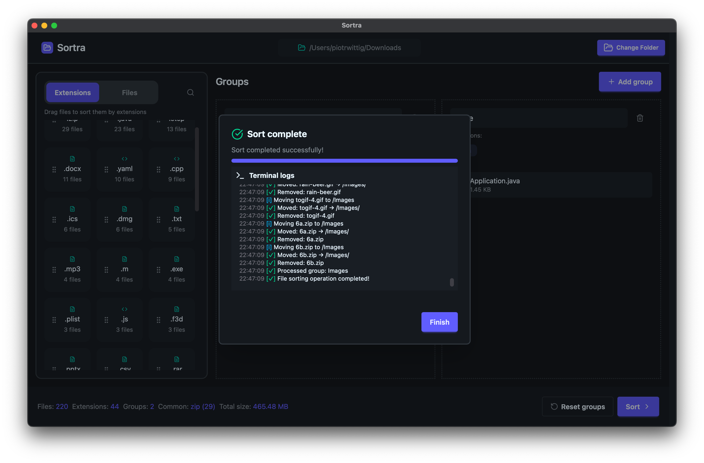

# Sortra

**Sortra** – cross-platform file organizer built with Tauri, React and Tailwind CSS.  
Clean up messy folders by automatically sorting files into custom categories.

---

## ✨ Features

- 🗂️ Organize files by type, extension, or custom logic
- ⚡ Lightweight and fast (thanks to Tauri)
- 🎨 Stylish UI powered by Tailwind CSS + DaisyUI
- 🧩 Cross-platform: works on Windows, macOS, and Linux
- 🔒 Safe and local – no files ever leave your machine

---

## 🚀 Installation

You need to install rust. Visit https://www.rust-lang.org/tools/install for further instructions.

```bash
git clone https://github.com/Schoji/Sortra.git
cd Sortra
npm install
npm run tauri dev
```

---

## 🛠️ Technologies Used

- [Tauri](https://tauri.app) – secure & fast native app framework
- [React](https://reactjs.org) – UI components
- [Tailwind CSS](https://tailwindcss.com) – utility-first styling
- [DaisyUI](https://daisyui.com) – beautiful UI components for Tailwind
- [dnd-kit](https://dndkit.com/) – drag-and-drop engine

---

## 💡 How It Works

1. Select a directory
2. Create custom **groups**
3. Drag file **extensions** or **individual files** into groups
4. Click **"Sort"** – Sortra will move files into corresponding subfolders
5. Optionally reset and start over

---

## 📸 Screenshots

Organize files effortlessly with a clean and intuitive interface.







---

## ❤️ Support

If you find this project useful, consider [donating on PayPal](https://www.paypal.com/donate/?hosted_button_id=NS5B4E326KRYE)  
to help keep it alive and support further development 💖  
Every bit helps and is greatly appreciated!

---

## 📃 License

You are free to:

- ✅ Use this project for personal or educational purposes
- ✅ Modify the source code as much as you like

But you're **not allowed to**:

- ❌ Redistribute or publish modified or original versions
- ❌ Use this project or its derivatives for commercial purposes
- ❌ Re-upload the app to app stores or code hosting sites

If you want to share or publish something based on Sortra – just ask for permission 🙂
